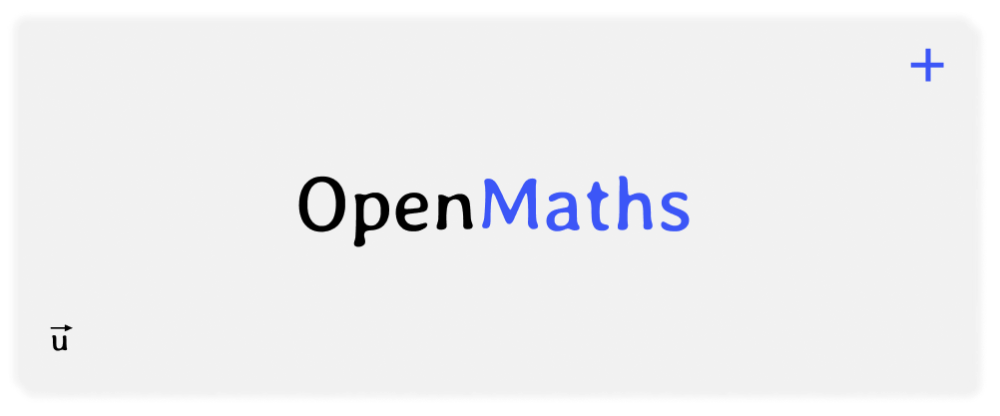

### [OpenMaths](https://openmaths.opengeometry.io/)

OpenMaths is a mathematical library designed for graphical applications in Rust and OpenGeometry. It provides essential mathematical structures and operations, including vectors, matrices, and more, to facilitate complex calculations in graphics programming.

### Features
- **Vector3**: A 3D vector structure with basic operations.
- **Matrix3**: A 3x3 matrix structure for transformations and calculations.
- **Matrix4**: A 4x4 matrix structure for 3D transformations and projections.

### Development
- **Language**: Rust
- **License**: [MIT License](LICENSE)

### Usage
To use the OpenMaths library in your Rust project, add the following dependency to your `Cargo.toml` file:
```toml
[dependencies]
openmaths = "0.2.1"
```

### Example
Here is a simple example of how to use the `Vector3` and `Matrix3` structures in your Rust application:
```rust
use openmaths::{Vector3, Matrix3};
fn main() {
    // Create a new Vector3
    let mut vec = Vector3::new(1.0, 2.0, 3.0);
    
    // Perform some operations
    vec.add_scalar(5.0);
    println!("Vector after adding scalar: {:?}", vec);

    // Create a new Matrix3
    let mut mat = Matrix3::identity();
    
    // Perform matrix operations
    mat.multiply_scalar(2.0);
    println!("Matrix after multiplying by scalar: {:?}", mat);
}
```
This example demonstrates how to create a `Vector3`, perform operations on it, and create a `Matrix3` with basic operations.

### Building and Running
To build and run the OpenMaths library, follow these steps:
1. Clone the repository
   ```bash
   git clone  
   ```
2. Navigate to the project directory
   ```bash
   cd OpenMaths
   ```
3. Build the project
   ```bash
   cargo build
   ```
4. We also compile to WebAssembly (WASM) for use in web applications
   ```bash
   wasm-pack build --target web
   ``


